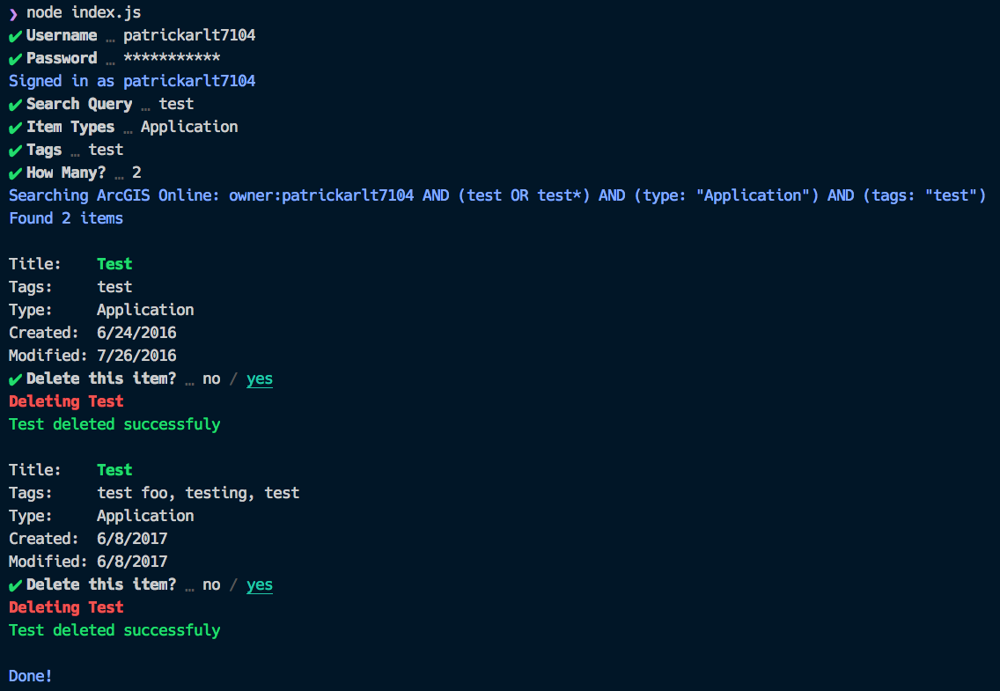

# Node JS CLI Item Management

Demo CLI application.

## Running this demo

1. Run `npm install` to install the dependencies.
2. Run `npm start`

### Local ArcGIS REST JS

If you'd like to use a local version of ArcGIS REST JS, follow the [steps in the parent README](../README.md#local-arcgis-rest-js-npm), referencing these packages that this sample uses as necessary:

- `arcgis-rest-request`
- `arcgis-rest-portal`

